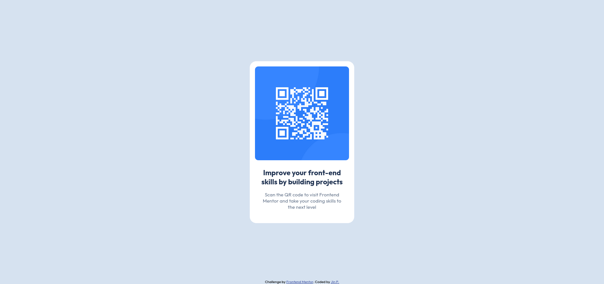

# Frontend Mentor - QR code component solution

This is a solution to the [QR code component challenge on Frontend Mentor](https://www.frontendmentor.io/challenges/qr-code-component-iux_sIO_H). Frontend Mentor challenges help you improve your coding skills by building realistic projects. 

## Table of contents

- [Overview](#overview)
  - [Screenshot](#screenshot)
  - [Links](#links)
- [My process](#my-process)
  - [Built with](#built-with)
  - [What I learned](#what-i-learned)
  - [Useful resources](#useful-resources)
- [Author](#author)

## Overview

### Screenshot



### Links

- Solution URL: [QR Code Solution URL](https://www.frontendmentor.io/solutions/qr-code-component-CbTkTHpyX3)
- Live Site URL: [QR Code Challenge Live Site](https://ri-zal.github.io/frontend-mentor/qr-code-component-main/)

## My process

### Built with

- Semantic HTML5 markup
- CSS custom properties
- Flexbox

### What I learned

For this project, I learned how to be more familiar with positioning, flexbox properties, CSS variables, and relative units as shown in the code snippet below. I learned that using ``rem`` instead of ``px`` for font size was good practice and decided to implement that in this challenge.

```css
body {
  background: hsl(212, 45%, 89%);
  font-family: "Outfit", sans-serif;
  min-height: 100vh;
  display: flex;
  flex-direction: column;
  justify-content: center;
  align-items: center;
}
```

For smaller details such as ``padding`` and ``margin``, I used Figma for the first time to look at the design at a closer level through this challenge's ``.fig`` files. As a result, I was able to get a glance of how developers and designers work together.

### Useful resources

- [CSS Flexbox Layout Guide](https://css-tricks.com/snippets/css/a-guide-to-flexbox/) - Resource for various flexbox properties.
- [CSS Layout - The position Property](https://www.w3schools.com/css/css_positioning.asp) - Shows the differences between positioning values. It helped me figure out what value to use to make my ``footer`` element stay at the very bottom.
- [CSS Unit Guide](https://www.freecodecamp.org/news/css-unit-guide/) - An article that shows the different CSS units you can use.

## Author

- GitHub - [ri-zal](https://github.com/ri-zal)
- Frontend Mentor - [@ri-zal](https://www.frontendmentor.io/profile/ri-zal)